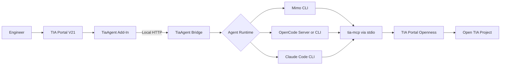

# TIA Portal Code Agent

[](#project-status)
[](#project-status)
[](#requirements)
[](#requirements)
[](#requirements)

A local, AI-assisted engineering interface for Siemens TIA Portal. The project connects contextual actions inside a TIA Portal Add-In to interchangeable coding-agent runtimes and exposes project data through the Model Context Protocol (MCP).

> [!CAUTION]
> **This project is under active development and is not ready for production use.**
>
> Do not use it on live production systems, safety programs, or any workflow where an incorrect response or modification could affect people, equipment, availability, or regulatory compliance. Current work is focused on experimental, read-only engineering assistance and end-to-end validation.

## Overview

TIA Portal Code Agent is designed to let an engineer select an object in TIA Portal and invoke contextual actions such as:

- Explain a PLC block or project object.
- Review logic and identify potential issues.
- Trace dependencies, references, and signal usage.
- Interpret compilation diagnostics.
- Generate engineering documentation.
- Prepare controlled change proposals for future approval-based workflows.

The Add-In remains the user-facing integration inside TIA Portal. A local Bridge manages task execution and delegates each request to the configured agent runtime. The runtime uses `tia-mcp` to access supported TIA Portal Openness capabilities.

## Project Status

The repository contains a working experimental architecture, but it has **not** reached production readiness.

| Area | Current state |
|---|---|
| TIA Portal V21 Add-In | Implemented and under validation |
| Context-menu actions | Implemented for supported project objects |
| Local Bridge API | Implemented |
| Runtime Supervisor | Implemented |
| Mimo CLI adapter | Experimental |
| OpenCode server/CLI adapter | Experimental |
| Claude Code CLI adapter | Experimental |
| MCP integration through `tia-mcp` | Implemented and under end-to-end validation |
| Read-only agent workflows | Current MVP focus |
| Approval-gated project changes | Planned / experimental groundwork only |
| PLC download, safety, hardware, and network changes | Not supported |
| Production deployment | **Not supported** |

Expect breaking changes in configuration, APIs, packaging, runtime behavior, and supported TIA Portal objects while development continues.

## Architecture



### Responsibilities

| Component | Responsibility |
|---|---|
| **TIA Portal Add-In** | Captures the selected object, exposes contextual commands, submits tasks, and displays progress and results |
| **TiaAgent Bridge** | Provides the local task API, resolves the selected runtime, manages execution, cancellation, diagnostics, and result normalization |
| **Runtime Supervisor** | Validates prerequisites, starts required local services, allocates ports, monitors health, and publishes service-discovery metadata |
| **Agent Runtime** | Performs model interaction, reasoning, session handling, and MCP tool calls |
| **`tia-mcp`** | Exposes supported TIA Portal capabilities through MCP and delegates them to TIA Portal Openness |
| **TIA Portal Openness** | Provides programmatic access to supported engineering objects and operations |

The Add-In is runtime-agnostic. Switching between Mimo, OpenCode, and Claude Code does not require changing the Add-In or the Bridge task contract.

## Supported Agent Runtimes

| Runtime | ID | Execution mode |
|---|---|---|
| Mimo CLI | `mimo` | One CLI process per task |
| OpenCode | `opencode` | Local HTTP server or one CLI process per task |
| Claude Code CLI | `claude` | One CLI process per task |

Runtime selection precedence:

1. Runtime specified in the task request.
2. `TIA_AGENT_RUNTIME` environment variable.
3. `defaultRuntime` in `%LOCALAPPDATA%\TiaAgent\config.json`.
4. `opencode` as the built-in default.

The Bridge does not silently switch runtimes when the selected runtime is unavailable. It returns an actionable error instead.

See [Runtime Configuration](docs/RUNTIME.md) for adapter behavior, configuration fields, and troubleshooting.

## Safety Model

The MVP follows a read-only-first approach.

### Allowed experimental scope

- Read project metadata.
- Inspect supported blocks and interfaces.
- Browse supported project structures.
- Analyze references and dependencies when exposed by the underlying APIs.
- Explain compilation messages.
- Produce suggestions and documentation.

### Outside the supported scope

- Downloading to a PLC.
- Starting, stopping, or controlling equipment.
- Online process control or monitoring actions.
- Safety-program modification.
- Arbitrary hardware or industrial-network changes.
- Unattended project-wide refactoring.
- Applying changes without an explicit preview and approval flow.
- Exposing Bridge or MCP services to an untrusted network.

Project content must be treated as untrusted data. Comments, object names, and source code must never be allowed to override system policies or authorize engineering changes.

## Requirements

| Requirement | Notes |
|---|---|
| Windows 10 or 11 | x64 only |
| Siemens TIA Portal | V21 with Openness installed |
| Visual Studio | Visual Studio 2022 recommended |
| .NET SDK | 8.0 or newer |
| .NET Framework Developer Pack | 4.8 |
| TiaMcpServer | `tia-mcp` available on `PATH` or in the .NET global-tools directory |
| Agent runtime | At least one of Mimo, OpenCode, or Claude Code |
| Windows group | User must belong to `Siemens TIA Openness` |

TIA Portal V21 uses modular Add-In assemblies. Do not add references to the removed monolithic `Siemens.Engineering.AddIn.dll` or legacy `PublicAPI\V21.AddIn` paths.

## Quick Start

> [!IMPORTANT]
> The following workflow is intended for local development and testing only.

### 1. Clone the repository

```powershell
git clone https://github.com/allanmarum/tia-portal-code-agent.git
cd tia-portal-code-agent
```

### 2. Install and validate the MCP server

```powershell
dotnet tool install -g TiaMcpServer
tia-mcp doctor
```

### 3. Install at least one agent runtime

Ensure one of these commands is available:

```powershell
mimo --version
opencode --version
claude --version
```

Refer to the official documentation for the runtime you choose. Runtime-specific configuration is documented in [`docs/RUNTIME.md`](docs/RUNTIME.md).

### 4. Build, test, package, and install the Add-In

```powershell
.\build.ps1 all
.\build.ps1 install
```

The generated `.addin` package is copied to:

```text
%APPDATA%\Siemens\Automation\Portal V21\UserAddIns\
```

### 5. Configure the default runtime

Create or edit `%LOCALAPPDATA%\TiaAgent\config.json`:

```json
{
  "defaultRuntime": "opencode",
  "runtimes": {
    "mimo": {
      "enabled": true,
      "executable": "mimo"
    },
    "opencode": {
      "enabled": true,
      "mode": "server",
      "executable": "opencode",
      "serverUrl": "http://127.0.0.1:43120"
    },
    "claude": {
      "enabled": true,
      "executable": "claude"
    }
  }
}
```

A temporary override can also be set through PowerShell:

```powershell
$env:TIA_AGENT_RUNTIME = "claude"
```

### 6. Start the local runtime services

```powershell
.\src\runtime\Scripts\run.ps1
```

Useful commands:

```powershell
# Show current service and runtime status
.\src\runtime\Scripts\status.ps1

# Return machine-readable status
.\src\runtime\Scripts\status.ps1 -Json

# Stop local services
.\src\runtime\Scripts\stop.ps1
```

Runtime state, service discovery, transient secrets, and logs are stored under:

```text
%LOCALAPPDATA%\TiaAgent\
```

### 7. Activate and test the Add-In

1. Open TIA Portal V21.
2. Open a test project containing a PLC program.
3. Go to **Options > Settings > Add-Ins**.
4. Activate **TIA Portal Code Agent** and review the requested permissions.
5. Right-click a supported PLC object.
6. Select an action under **AI Assistant**.

Use a disposable test project. Do not begin validation on an operational production project.

For the complete runbook, see [Running End-to-End](docs/RUN.md).

## Repository Structure

```text
tia-portal-code-agent/
├── src/
│   ├── TiaAgent.AddIn/          # TIA Portal integration and contextual UI
│   ├── TiaAgent.Application/    # Application orchestration and use cases
│   ├── TiaAgent.Bridge/         # Local API and runtime adapters
│   ├── TiaAgent.Contracts/      # Shared DTOs, events, errors, and contracts
│   ├── TiaAgent.OpenCode/       # OpenCode HTTP client
│   └── runtime/                 # PowerShell Runtime Supervisor
├── tests/
│   ├── TiaAgent.Application.Tests/
│   ├── TiaAgent.ArchitectureTests/
│   ├── TiaAgent.Bridge.Tests/
│   ├── TiaAgent.Contracts.Tests/
│   └── TiaAgent.Runtime.Tests/
├── agents/                      # Agent profiles and behavior rules
├── config/                      # Example runtime and Bridge configuration
├── docs/
│   ├── spec/                    # Architecture and product specifications
│   ├── RUN.md                   # End-to-end local runbook
│   └── RUNTIME.md               # Multi-runtime configuration
├── build.ps1                    # Build, test, package, and install entry point
├── AGENTS.md                    # Instructions for coding agents
└── TiaAgent.sln
```

## Development

### Common commands

```powershell
# Compile the solution
.\build.ps1 build

# Run the test suite
.\build.ps1 test

# Build the .addin package
.\build.ps1 pack

# Complete local validation pipeline
.\build.ps1 all
```

Direct .NET commands are also supported:

```powershell
dotnet build TiaAgent.sln --configuration Release
dotnet test TiaAgent.sln --configuration Release
```

### Engineering rules

- Never block the TIA Portal UI thread with network, model, or long-running engineering operations.
- Propagate cancellation and timeouts across process and HTTP boundaries.
- Keep Siemens engineering types out of shared contracts.
- Use structured error codes and correlation IDs.
- Bind local HTTP services to loopback only.
- Do not log credentials, tokens, or unnecessary project source.
- Do not implement project writes that bypass preview, concurrency checks, explicit approval, validation, and audit logging.
- Treat specifications in `docs/spec/` as authoritative architectural guidance.

## Documentation

| Document | Purpose |
|---|---|
| [`docs/RUN.md`](docs/RUN.md) | Complete local setup and end-to-end execution guide |
| [`docs/RUNTIME.md`](docs/RUNTIME.md) | Runtime selection, adapters, configuration, and troubleshooting |
| [`docs/spec/ARCHITECTURE.md`](docs/spec/ARCHITECTURE.md) | System architecture and component boundaries |
| [`docs/spec/PRODUCT_SPEC.md`](docs/spec/PRODUCT_SPEC.md) | Product scope, use cases, and requirements |
| [`docs/spec/SECURITY_MODEL.md`](docs/spec/SECURITY_MODEL.md) | Trust boundaries, permissions, and risk controls |
| [`docs/spec/KNOWN_UNKNOWNS.md`](docs/spec/KNOWN_UNKNOWNS.md) | Open technical questions and required evidence |
| [`AGENTS.md`](AGENTS.md) | Repository instructions for coding agents |

## Roadmap

Near-term priorities include:

- Stabilize the read-only TIA Portal → Bridge → runtime → MCP → TIA Portal round trip.
- Validate supported object types across TIA Portal V21 projects.
- Improve diagnostics, cancellation, recovery, and runtime health reporting.
- Add a clear runtime-selection experience for users.
- Expand automated integration and packaging tests.
- Design auditable preview and approval flows before enabling project writes.
- Define compatibility, signing, installation, and upgrade policies.

Production readiness will require explicit release criteria, broader compatibility testing, security review, operational documentation, and controlled validation in representative industrial environments.

## Contributing

This project is evolving quickly. Before making changes:

1. Read [`AGENTS.md`](AGENTS.md) and the relevant files in `docs/spec/`.
2. Confirm the current implementation phase and supported scope.
3. Keep changes focused and preserve architectural boundaries.
4. Run the relevant build and tests.
5. Document assumptions, limitations, and any newly discovered compatibility constraints.

Bug reports and pull requests should include the TIA Portal version, relevant runtime, reproducible steps, expected behavior, actual behavior, and sanitized logs where available.

## Disclaimer

This is an independent experimental project and is not affiliated with, endorsed by, or supported by Siemens, Anthropic, Mimo, OpenCode, or the maintainers of `tia-mcp`.

Siemens, SIMATIC, TIA Portal, and related product names are trademarks of their respective owners.

## License

No project license has been published yet. Do not assume permission for production use, redistribution, or commercial deployment until a license is added.