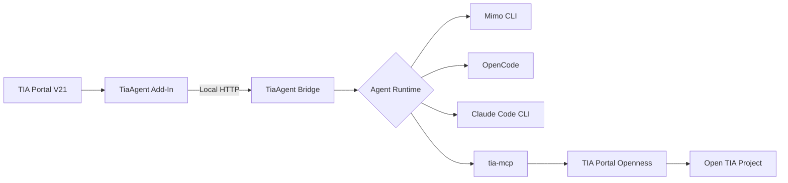

# TIA Portal Code Agent

[](#status)
[](#requirements)
[](#requirements)
[](LICENSE)

A local AI-assisted engineering interface for Siemens TIA Portal. It connects contextual Add-In actions to interchangeable coding-agent runtimes and exposes supported project data through the Model Context Protocol (MCP).

> [!CAUTION]
> This project is experimental and not ready for production use. Do not use it on live systems, safety programs, or workflows where an incorrect response or modification could affect people, equipment, availability, or compliance.

## What it does

From a supported object in TIA Portal, an engineer can invoke actions such as:

- explain PLC blocks and project objects;
- review logic and diagnostics;
- inspect references, dependencies, and signal usage;
- generate engineering documentation.

The current MVP is read-only first. PLC download, safety changes, hardware/network changes, and unattended project modifications are not supported.

## Architecture



- **Add-In:** captures context, submits tasks, and displays results.
- **Bridge:** manages tasks, runtime selection, cancellation, and diagnostics.
- **Agent runtime:** handles model interaction and MCP tool calls.
- **tia-mcp:** exposes supported TIA Portal Openness capabilities.

Supported runtimes: `mimo`, `opencode`, and `claude`.

## Status

Implemented and under validation:

- TIA Portal V21 Add-In;
- contextual actions;
- local Bridge API;
- Runtime Supervisor;
- Mimo, OpenCode, and Claude Code adapters;
- MCP integration through `tia-mcp`.

Breaking changes are expected while the architecture and end-to-end workflow are stabilized.

## Requirements

- Windows 10 or 11 x64;
- Siemens TIA Portal V21 with Openness installed;
- membership in the `Siemens TIA Openness` Windows group;
- Visual Studio 2022;
- .NET SDK 8 or newer;
- .NET Framework Developer Pack 4.8;
- `tia-mcp` installed;
- at least one supported agent runtime.

## Quick start

```powershell
git clone https://github.com/industrix-com-br/tia-portal-code-agent.git
cd tia-portal-code-agent

dotnet tool install -g TiaMcpServer
tia-mcp doctor

.\build.ps1 all
.\build.ps1 install

tia-agent start
```

Then:

1. Open a disposable project in TIA Portal V21.
2. Go to **Options > Settings > Add-Ins**.
3. Activate **TIA Portal Code Agent**.
4. Right-click a supported PLC object.
5. Choose an action under **AI Assistant**.

Use the following commands to inspect or stop local services:

```text
tia-agent status
tia-agent stop
```

For full setup and runtime configuration, see:

- [Running End-to-End](docs/RUN.md)
- [Runtime Configuration](docs/RUNTIME.md)

## Development

```powershell
.\build.ps1 build
.\build.ps1 test
.\build.ps1 pack
.\build.ps1 all
```

Contributors should read [AGENTS.md](AGENTS.md) and the specifications under [`docs/spec/`](docs/spec/).

## Safety

- Keep Bridge and MCP services bound to loopback.
- Do not log credentials, tokens, or unnecessary project source.
- Treat project content as untrusted data.
- Do not enable project writes without preview, concurrency checks, explicit approval, validation, and audit logging.

## Disclaimer

This is an independent project and is not affiliated with, endorsed by, or supported by Siemens, Anthropic, Mimo, OpenCode, or the maintainers of `tia-mcp`.

Siemens, SIMATIC, TIA Portal, and related product names are trademarks of their respective owners.

## Third-party assets

See [THIRD_PARTY_NOTICES.md](THIRD_PARTY_NOTICES.md) for third-party
asset attribution and licensing information.

## License

Licensed under the [Apache License 2.0](LICENSE).
