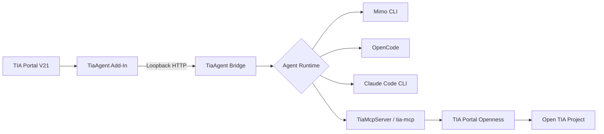

# TIA Portal Code Agent

[](#status)
[](#requirements)
[](#requirements)
[](LICENSE)

A local AI-assisted engineering interface for Siemens TIA Portal. It connects contextual Add-In actions to interchangeable coding-agent runtimes and exposes supported project data through the Model Context Protocol (MCP).

> [!CAUTION]
> This project is experimental and is not ready for production use. Do not use it on live systems, safety programs, or workflows where an incorrect response could affect people, equipment, availability, or compliance.

## Current behavior

From a supported object in TIA Portal V21, an engineer can invoke:

- **Explain selected object**;
- **Review selected object**;
- **Propose change**.

The current product workflow is read-only: the proposal action returns recommendations and does not directly modify the TIA project. PLC download, safety changes, hardware or network changes, and unattended project modification are not supported.

## Architecture


```mermaid
flowchart LR
    TIA[TIA Portal V21] --> ADDIN[TiaAgent Add-In]
    ADDIN -->|Loopback HTTP| BRIDGE[TiaAgent Bridge]
    BRIDGE --> RUNTIME{Agent Runtime}
    RUNTIME --> MIMO[Mimo CLI]
    RUNTIME --> OPENCODE[OpenCode]
    RUNTIME --> CLAUDE[Claude Code CLI]
    RUNTIME --> MCP[TiaMcpServer / tia-mcp]
    MCP --> OPENNESS[TIA Portal Openness]
    OPENNESS --> PROJECT[Open TIA Project]
```

- **Add-In:** captures the selected object, submits tasks, and displays results.
- **Bridge:** manages tasks, runtime selection, cancellation, authentication, and diagnostics.
- **Runtime Supervisor:** starts and monitors the Bridge and server-mode runtimes.
- **Agent runtime:** performs model interaction and invokes MCP tools.
- **TiaMcpServer:** provides the external TIA Portal MCP integration.
- **CLI:** installs versioned payloads and manages runtime lifecycle.

Supported runtime IDs are `mimo`, `opencode`, and `claude`.

## Status

Implemented and under validation:

- TIA Portal V21 Add-In;
- contextual explain, review, and proposal actions;
- WPF response window with MessageBox fallback;
- local Bridge API;
- Runtime Supervisor;
- Mimo, OpenCode, and Claude Code adapters;
- MCP integration through `tia-mcp`;
- versioned CLI payload installation, update, activation, rollback, and removal.

Breaking changes remain possible while the end-to-end workflow is stabilized.

## Requirements

For users:

- Windows 10 or 11 x64;
- Siemens TIA Portal V21 with Openness installed;
- membership in the `Siemens TIA Openness` Windows group;
- .NET 8 SDK for the CLI and Bridge;
- .NET Framework 4.8 runtime for the Add-In;
- `TiaMcpServer` installed;
- at least one supported agent runtime.

For contributors building and packaging the Add-In, Visual Studio 2022 and an installed TIA Portal V21 development environment are also required.

## Installation

> [!IMPORTANT]
> The project currently publishes only prerelease versions such as `alpha` and `beta`. Without `--prerelease` or an explicit `--version`, the .NET tool command searches only for a stable release and may report that `TiaAgent.Cli` was not found even though prerelease packages exist.

```powershell
# Recommended while the project is in prerelease
dotnet tool install --global TiaAgent.Cli --prerelease

# Install a specific prerelease version
dotnet tool install --global TiaAgent.Cli --version 0.3.0-beta.5

# Install and activate the payload
tia-agent install

# Start services
tia-agent start
```

After the first stable version is published, the CLI can be installed without additional options:

```powershell
dotnet tool install --global TiaAgent.Cli
```

Restart TIA Portal, enable **TIA Portal Code Agent** under **Options > Settings > Add-Ins**, then right-click a supported project object and choose an action under **AI Code Agent**.

See the [Installation Guide](docs/INSTALLATION.md) for prerequisites and deployment details.

## Quick commands

| Command | Description |
|---|---|
| `tia-agent version --verbose` | Show CLI, active, and installed payload versions |
| `tia-agent doctor` | Run environment and setup diagnostics |
| `tia-agent status` | Show runtime status and health |
| `tia-agent start` | Start and monitor runtime services |
| `tia-agent stop` | Stop runtime services |
| `tia-agent update` | Install and activate the payload bundled with the current CLI |
| `tia-agent rollback` | Activate a previous installed payload |
| `tia-agent channel` | View or change the update channel |
| `tia-agent runtime list` | List configured runtimes and availability |

See the [CLI Reference](docs/CLI.md) or run `tia-agent --help`.

## Documentation

- [Documentation Index](docs/README.md)
- [Installation Guide](docs/INSTALLATION.md)
- [CLI Reference](docs/CLI.md)
- [Configuration Reference](docs/CONFIGURATION.md)
- [Running End-to-End](docs/RUN.md)
- [Runtime Configuration](docs/RUNTIME.md)
- [Updating](docs/UPDATING.md)
- [Rollback](docs/ROLLBACK.md)
- [Troubleshooting](docs/TROUBLESHOOTING.md)
- [Versioning Policy](docs/VERSIONING.md)
- [Release Process](docs/RELEASING.md)
- [Installed Layout](docs/LAYOUT.md)
- [Architecture](docs/spec/ARCHITECTURE.md)
- [Security Model](docs/spec/SECURITY_MODEL.md)

## Development

```powershell
.\build.ps1 build
.\build.ps1 test
.\build.ps1 pack
.\build.ps1 install-dev
```

`build.ps1` is the repository build and release entry point. Public releases use `release -Version <version>` from an immutable Git tag.

## Safety

- Keep Bridge and runtime services bound to loopback.
- Do not log credentials, tokens, or unnecessary project source.
- Treat project content as untrusted data.
- Do not enable project writes without a separate implementation and safety review.

## Disclaimer

This independent project is not affiliated with, endorsed by, or supported by Siemens, Anthropic, Mimo, OpenCode, or the maintainers of `tia-mcp`.

Siemens, SIMATIC, TIA Portal, and related product names are trademarks of their respective owners.

## Third-party assets

See [THIRD_PARTY_NOTICES.md](THIRD_PARTY_NOTICES.md).

## License

Licensed under the [Apache License 2.0](LICENSE).
